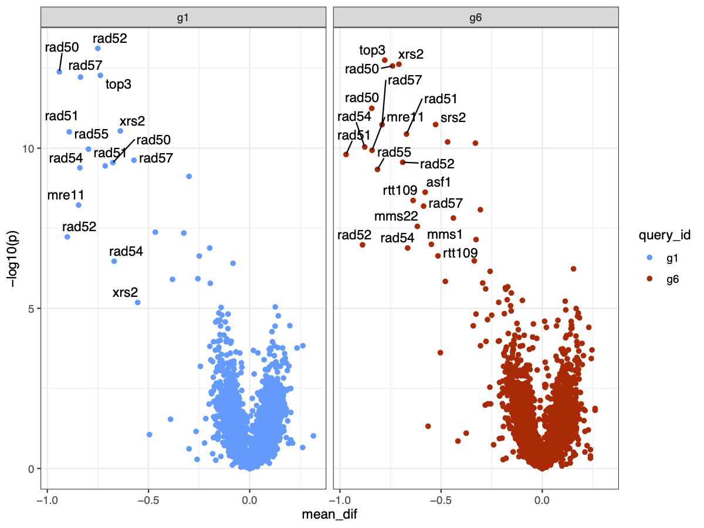

## CAS9 Volcano plot

This R project file contains code and data used to produce figures 4A
and S4C in the manuscript *Leading and lagging strand fork collapses
differ in structure and requirements for repair* by Michael T Kimble,
Aakanksha Sane, Robert JD Reid, Meret Arter, Matthew J Johnson, Rodney
Rothstein, Scott Keeney and Lorraine S Symington. In revision for
*Molecular Cell*.

A mutant version of *CAS9* was used to make single strand breaks in
genomic DNA using RNA guides targeting sites on yeast chromosome VI. A
CAS9 and guide RNA expression plasmid was transferred into the
approximately 4800 strains of a yeast gene disruption library using the
selective ploidy ablation (SPA) protocol (R. J. D. Reid et al. 2011).
CAS9 expression was induced in these mutant strains, growth was
determined by colony size using the *screenmill* R package (R. J. Reid
and Bryant 2024) and growth of each strain was compared to a scrambled
guide control or an empty vector control.

This project imports processed data from *screenmill* output, combines
data from two runs of the SPA screen, and calculates a *t*-statistic and
*p*-value for the growth comparison. These are plotted in a “volcano”
plot which is normalized growth difference by *p*-value shown below.
Note that *screenmill* requires a version less than 4.2 due to a
breaking change in one of the packages it relies on.

## References

Reid, Robert J. D., Sergio González-Barrera, Ivana Sunjevaric, David
Alvaro, Samantha Ciccone, Marisa Wagner, and Rodney Rothstein. 2011.
“Selective Ploidy Ablation, a High-Throughput Plasmid Transfer Protocol,
Identifies New Genes Affecting Topoisomerase I–Induced DNA Damage.”
*Genome Research* 21 (3): 477–86.
<https://doi.org/10.1101/gr.109033.110>.

Reid, Robert JD, and Eric Bryant. 2024. “Screenmill.”
<https://https://github.com/RobertJDReid/screenmill>.
